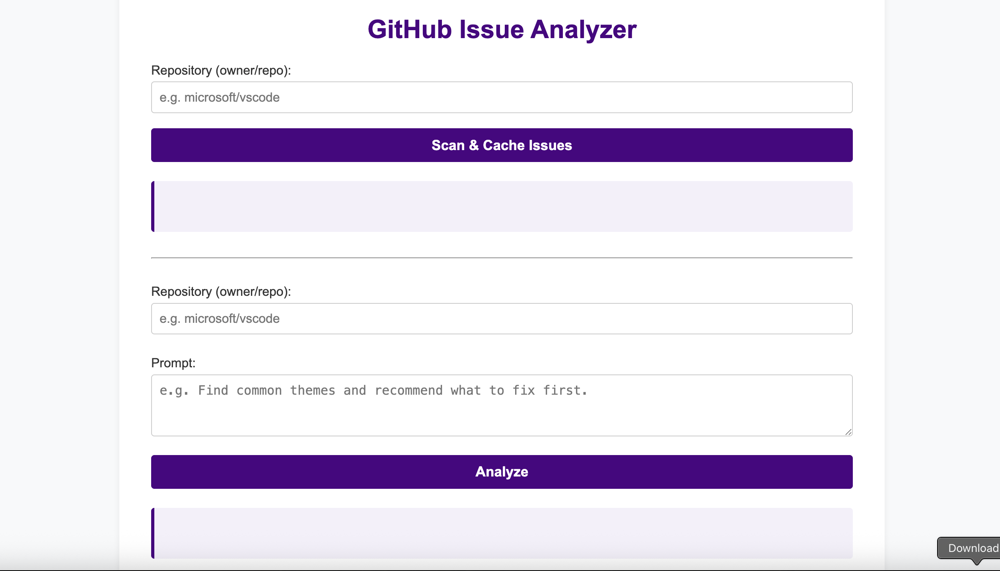
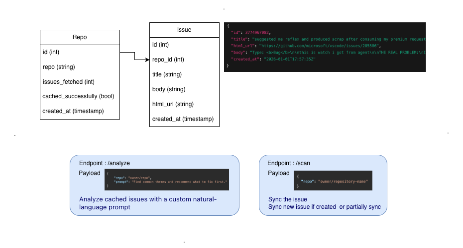

<div align="center">
	
</div>

# 🚀 GitHub Issue Analyzer

Analyze and summarize GitHub issues for any public repository using LLMs, with local caching and a modern web UI.

---

## Features

- **Scan & Cache:** Fetches all open issues from any public GitHub repository and stores them locally.
- **Analyze:** Uses OpenAI LLM to analyze cached issues with a custom natural-language prompt.
- **Modern Frontend:** Simple, responsive web UI for scanning and analyzing repositories.
- **Authentication:** HTTP Basic Auth for all endpoints and admin panel.
- **Admin Panel:** View cached issues and repositories via a built-in admin UI.
- **Logging:** Rotating file logs for all operations (`logs/app.log`).

---

## Tech Stack

- **Backend:** FastAPI, SQLModel, SQLAlchemy, OpenAI API
- **Frontend:** HTML, CSS, JavaScript (fetch, marked.js)
- **Database:** SQLite (default, can be changed)
- **Admin:** sqladmin

---


## Project Structure

```text
kusho/
├── core/              # Config, logger, database setup
├── models/            # SQLModel ORM models (Issue, Repo)
├── routes/            # FastAPI route definitions
├── services/          # Business logic for scan/analyze
├── view/              # Frontend (index.html, styles.css)
├── logs/              # Rotating log files
├── main.py            # FastAPI app entrypoint
├── pyproject.toml     # Project metadata & dependencies
├── README.md          # This file showing usage instructions
├── .env, .env.example # Environment variables
├── requirements.txt   # Python dependencies
└── database.db        # SQLite database (auto-created)
```

---

## Getting Started

### 1. Clone the Repository

```bash
git clone https://github.com/jyotiprakash-m/github-issue-analyzer.git
cd github-issue-analyzer
```


### 2. Install Dependencies (with and without [uv](https://github.com/astral-sh/uv))

```bash
# Recommended: Use Python 3.10+
python3 -m venv .venv
source .venv/bin/activate
uv pip install -r requirements.txt
```

Or, to install and run in one step (if you have uv):


```bash
# uv is a super-fast Python package manager. If you don't have it
pip install uv

# Install dependencies from pyproject.toml
uv sync
```

### 3. Configure Environment

Copy `.env.example` to `.env` and set your credentials and OpenAI API key:

```env
DATABASE_URL=sqlite:///database.db
USERNAME=admin
PASSWORD=password
OPENAI_API_KEY=sk-...
```

### 4. Run the Application

```bash
uvicorn main:app --reload
# or
uv run ./main.py
```

The app will be available at [http://localhost:8000](http://localhost:8000)

---

## Usage

### Web UI

Visit [http://localhost:8000](http://localhost:8000) and use the forms to scan and analyze any public GitHub repo.

You will be prompted for HTTP Basic Auth credentials (from your `.env`).

### API Endpoints

#### 1. Scan Repository

`POST /scan`

Request JSON:
```json
{
	"repo": "owner/repo"
}
```
Response:
```json
{
	"repo": "owner/repo",
	"issues_fetched": 42,
	"cached_successfully": true
}
```

#### 2. Analyze Issues

`POST /analyze`

Request JSON:
```json
{
	"repo": "owner/repo",
	"prompt": "Find common themes and recommend what to fix first."
}
```
Response:
```json
{
	"analysis": "...LLM-generated markdown..."
}
```


#### 3. API Documentation

- **Swagger UI:** [http://localhost:8000/docs](http://localhost:8000/docs)
- **ReDoc:** [http://localhost:8000/redoc](http://localhost:8000/redoc)

Both endpoints provide interactive API documentation and testing for all available endpoints.

#### 4. Admin Panel

Visit `/admin` (e.g., [http://localhost:8000/admin](http://localhost:8000/admin)) and log in with your credentials to view cached data.

---

## Logging

All logs are written to `logs/app.log`. To view logs in real time:


### View Logs with lnav

#### macOS
```bash
brew install lnav
lnav logs/app.log
```

#### Linux (Debian/Ubuntu)
```bash
sudo apt-get install lnav
lnav logs/app.log
```

#### Windows
Download the latest lnav release from [https://github.com/tstack/lnav/releases](https://github.com/tstack/lnav/releases) and run:

```powershell
lnav logs/app.log
```

---

# Below are some additional details work through during development.

## Why This Local Storage Option?

This project uses SQLite as the local storage solution. SQLite is lightweight, serverless, and easy to set up, making it ideal for small to medium-sized projects and local development. It requires no additional configuration and stores data in a single file, which simplifies deployment and portability.

## Prompts Used During Development

Below are some of the prompts used with AI coding tools and for designing, debugging, and constructing the LLM request logic:

### General Coding & Debugging
- "How do I create a FastAPI endpoint that analyzes GitHub issues?"
- "Generate a Pydantic model for a GitHub issue with title, body, and labels."
- "How to connect FastAPI with SQLite using SQLAlchemy?"
- "How to serve static files in FastAPI?"

### LLM Request Construction (analyze endpoint)
- "Prompt template for summarizing GitHub issues using an LLM."
- "How to structure a prompt for extracting key insights from text?"
- "Best practices for sending user input to OpenAI API in FastAPI."

### README & Documentation
- "How to embed a YouTube video and image in README.md?"
- "What sections should be included in a project README for an AI coding assignment?"

## Troubleshooting

- Ensure your OpenAI API key is valid and has quota.
- If you see repeated login prompts, check your credentials in `.env`.
- For database issues, delete `database.db` to reset (will lose cached data).

---
## Demo

<div align="center" style="margin: 1.5em 0;">
	<a href="https://youtu.be/Oqxi8HQVdBs" target="_blank">
		
	</a>
	<br>
	<em>Demo: See the app in action!</em>
</div>

---
## Schema Architecture

<div align="center" style="margin: 2em 0;">
	
	<br>
	<em>Schema Architecture Overview</em>
</div>